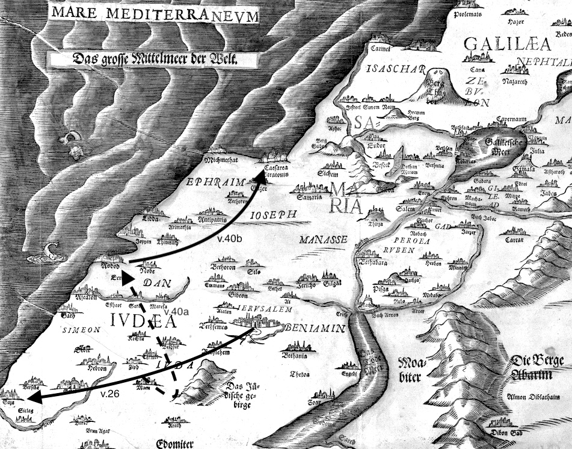

## Introduction
Après des conversions de masse, voilà le premier récit de baptême d’un individu. L’évangélisation hors de Jérusalem est l’occasion pour les hellénistes de se confronter aux marginaux du judaïsme : les samaritains, puis ceux de la diaspora[^1].

Les samaritains font bon accueil à l’annonce du Messie par Philippe, qui opère miracles et exorcismes, les détournant ainsi de Simon le magicien et baptisant tout le monde « *au nom du Seigneur Jésus* » (Ac 8,16). Pierre et Jean montent de Jérusalem pour imposer les mains et permettre le don de l’Esprit-Saint. Ils rentrent après leur confrontation avec Simon. 

La rencontre avec l’eunuque éthiopien, chargée d’un parfum d’exotisme, nous rappelle celle du sage Salomon et de la reine de Saba. Elle venait alors avec « *des chameaux chargés d’aromates, d’une énorme quantité d’or et de pierres précieuses* ». (1R 10,2 // 2Ch 9,1). Le royaume de Saba correspond au Yémen et au nord de l’Éthiopie. La tradition juive rapporte que la reine aurait rapporté la foi en le Dieu unique d’Israël.

Les samaritains sont touchés par la proclamation du Christ, l’eunuque par l’explication des Écritures à la lumière du Ressuscité. La fougue missionnaire du diacre Philippe, guidé par l’Esprit-Saint, permet à ces deux groupes mis à l’écart du judaïsme et du Temple d’être réunis par le baptême. De là, la réunification du peuple juif et une première étape à l’ouverture aux nations, en dépassant les barrières de la loi juive. 

Voici ma thèse : les chrétiens hellénistes en dispersion suite aux persécutions rencontrent ceux que le judaïsme dénigrait. Inspirés par l’Esprit-Saint, ils interprètent les Écritures à la façon du Christ pour accomplir la Loi et accueillir les marginaux.

## I. Vue d’ensemble
### « *Les campagnes de Judée et de Samarie* », Ac 8,5-15,29
Reprenons le plan des Actes qui nous fut présenté par le père Jean-Philippe Fabre. Un plan respectant les instructions de Jésus en Ac 1,8 : que les disciples soient ses témoins « *à Jérusalem, dans toute la Judée et la Samarie, et jusqu’aux extrémités de la terre* ». La première partie fut consacrée à la vie de l’Église à Jérusalem, dans une croissance en cohabitation dans le Temple, et en crise dans son opposition aux autorités religieuses d’Israël. Suite à la lapidation d’Etienne (7,54-60) que nous exposa Alexis la semaine passée, au début du chapitre 8, « *une violente persécution se déchaîna contre l’Église de Jérusalem* » (Ac 8,1). Heureuse persécution[^2] qui nous a valu une telle dispersion dans « *les campagnes de Judée et de Samarie* » (Ac 8,1). Nous voilà au début de la deuxième partie des Actes : Philippe part en Samarie, annonce la Bonne Nouvelle et baptise des samaritains, bientôt rejoint par Pierre et Jean qui imposent les mains pour que les samaritains reçoivent l’Esprit-Saint.

### Délimitation
#### Limites externes
La délimitation de la péricope est très claire. L’épisode précédent où Pierre et Jean viennent en Samarie pour donner l’Esprit-Saint et s’occuper de Simon le magicien se termine par le retour des apôtres à Jérusalem tout en évangélisant. Puis on revient à Philippe : « *Ils retournèrent à Jérusalem en annonçant l’Évangile à un grand nombre de villages samaritains. L’ange du Seigneur adressa la parole à Philippe* » (Ac 8, 25b-26a).

Alors, on accompagne le diacre dans sa rencontre de l’eunuque, la route qu’ils font en commun, le baptême, puis les deux personnages se séparent et continuent leur chemin. Changement de protagoniste au verset suivant, « *Cependant Saul…* » (Ac 9, 1a) : on passe à la vocation de Paul.

#### Limites stylistiques
On repère également que deux petits sommaires encadrent la péricope :
> Quant à Pierre et Jean, ayant rendu témoignage et proclamé la parole du Seigneur, ils retournèrent à Jérusalem en annonçant l’Évangile (εὐηγγελίζοντο) à un grand nombre de villages samaritains. (Ac 8, 25)
> Philippe se retrouva dans la ville d’Ashdod, il annonçait la Bonne Nouvelle (εὐηγγελίζετο) dans toutes les villes où il passait jusqu’à son arrivée à Césarée. (Ac 8, 40)

Deux sessions d’évangélisations, les villes de Samarie voient passer les Apôtres (Philippe ayant déjà préparé le terrain). Et les villes de la côte méditerranéenne de Samarie voient passer Philippe, d’Azot/Ashdod à Césarée, cette dernière annonçant l’ouverture au monde païen.

### Structure
Nous avons à faire à une construction concentrique, dont les extrémités se correspondent, en chiasme.

- A. 26-28 Introduction : présentation des personnages 
    - B. 29 Rencontre provoquée par l’Esprit
        - C. 30-31 Dialogue sur la lecture d’Isaïe 
            - D. 32-33 Citation d’Isaïe 53,7b-8c
        - C’. 34-35 Dialogue sur l’interprétation d’Isaïe 
    - B’. 36.38 Baptême de l’eunuque
- A’. 39-40 Épilogue : la séparation des personnages

En A et A’ : Les interventions surnaturelles qui encadrent la rencontre (l’ange du Seigneur et la translocation) mettent en exergue l’organisation divine et dramatisent la rencontre[^3]. En B et B’, les actes des protagonistes : à l’Esprit qui envoie Philippe en mission fait écho le baptême, de l’eunuque. En C et C’, le dialogue : à la lecture d’Isaïe répond son interprétation. Au centre, la Parole. Dieu est omniprésent : action surnaturelle (A), obéissance à l’Esprit et sacrement (B), partage sur l’Écriture (C), et Parole de Dieu (D).

On remarque une *synkrisis*, un parallélisme très fort avec l’épisode des pèlerins d’Emmaüs :

| Lc 24,13-33 | Ac 8, 26-39 |
|:--|:--|
| Présentation des deux hommes qui parlent des événements récents. | Envoi de Philippe. Présentation de l’eunuque qui lit le prophète Isaïe. |
| Jésus les rejoint et les interroge. | Philippe le rattrape et l’interroge. |
| Ils racontent les événements énigmatiques. | L’eunuque demande des explications. |
| Jésus interprète les Écritures qui parlent de lui (et qui donnent un sens aux événements). | Philippe annonce ce qui concerne Jésus (éclairant ainsi la prophétie). |
| Ils invitent Jésus à rester. Fraction du pain, reconnaissance, Jésus disparait. | L’eunuque demande le baptême. Baptême et disparition de Philippe. |
| Tout émus, ils se mettent en route vers les autres. | L’eunuque poursuit sa route, rempli de joie. |

Ce rapprochement nous invitera à en étudier les similarités et les dissemblances : de deux juifs à un eunuque étranger, de l’interprétation de l’évènement Jésus à l’interprétation *par* l’évènement Jésus, etc.

## II. Analyse linéaire

### A. v. 26-28 Introduction : présentation des personnages

#### v. 26 : la mission de Philippe
> 26 Ἄγγελος δὲ κυρίου ἐλάλησεν πρὸς Φίλιππον λέγων· Ἀνάστηθι καὶ πορεύου κατὰ μεσημβρίαν ἐπὶ τὴν ὁδὸν τὴν καταβαίνουσαν ἀπὸ Ἰερουσαλὴμ εἰς Γάζαν· αὕτη ἐστὶν ἔρημος.
> 26 Un ange du Seigneur parla à Philippe, disant « Lève-toi et marche du côté du Midi sur la route qui descend de Jérusalem vers Gaza ; elle est déserte. »

Nous l’avons vu, la narration revient soudainement à Philippe. Mais qui est Philippe ? Il y a un apôtre (listé en Ac 1, 13[^4]) et un diacre (listé en Ac 6, 5[^5]). L’institution des diacres est toute récente, seuls deux chapitres séparent cette énumération de la mission de Philippe en Samarie : ce sont les chapitres 6 et 7, presque exclusivement dédiés à l’arrestation, le discours et la lapidation d’Étienne. On peut donc légitimement estimer que c’est bien du diacre Philippe dont on parle au chapitre 8. La confirmation nous sera donnée plus tard dans les Actes : « *à Césarée, nous sommes entrés dans la maison de Philippe, l’évangélisateur, qui était l’un des Sept* » (Ac 21, 8). Philippe, comme son étymologie grecque nous l’indique, fait partie des *Hellénistes*, des Juifs hellénisés « *originaires des pays du pourtour de la Méditerranée ; ils parlent le grec, utilisent la Septante* »[^6].

Signifiant l’importance de la mission à venir, c’est  « *l’ange du Seigneur* » qui intervient pour un ordre surprenant : partir sur une route déserte (car) en plein soleil (à « *l’heure de midi* »). Voilà qui souligne la docilité de Philippe à une demande qui peut sembler absurde. Surprise du lecteur qui croit que la mission s’oriente vers la Samarie : cette route entre Jérusalem et Gaza est en Judée.

D. Marguerat préfère le sens géographique « *du côté du midi* », donc le sud, comme une ouverture au-delà de Gaza, vers l’Afrique. Cette seconde partie concerne la mission en Samarie, royaume du Nord. Son but étant d’accomplir l’unification avec le Royaume du Sud. Je préfère le midi horaire, qui semble être l’heure des révélations dans les Actes : Paul sur le chemin de Damas, la vision de Pierre, ou encore la Samaritaine chez Lc. Est-ce l’heure de l’ouverture aux païens ? La lumière du Seigneur surpasse celle du soleil et vient marquer définitivement ceux qu’elle frappe, comme l’Éthiopien.

Enfin, on peut discerner une forme de prolepse au texte central par l’envoi d’un évangélisateur dans un environnement désert, qui évoque l’annonce de la délivrance en Is 40, 3 : « *Une voix crie dans le désert, préparez le chemin du Seigneur* ». C’est le début de la seconde partie du livre d’Israël qu’on appelle le livre de la consolation d’Israël.

#### v. 27-28 : l’eunuque
> 27 καὶ ἀναστὰς ἐπορεύθη, καὶ ἰδοὺ ἀνὴρ Αἰθίοψ εὐνοῦχος δυνάστης ⸀Κανδάκης βασιλίσσης Αἰθιόπων, ὃς ἦν ἐπὶ πάσης τῆς γάζης αὐτῆς, ὃς ἐληλύθει προσκυνήσων εἰς Ἰερουσαλήμ, 28 ἦν ⸀τε ὑποστρέφων καὶ καθήμενος ἐπὶ τοῦ ἅρματος αὐτοῦ καὶ ἀνεγίνωσκεν τὸν προφήτην Ἠσαΐαν.
> 27 Et se levant, il est allé. Et voici, un homme éthiopien, eunuque, dignitaire de Candace reine des Éthiopiens, qui était (responsable) sur tout son trésor, venu se prosterner à Jérusalem, 28 s’en retournait ; assis sur son char, il lisait le prophète Isaïe.

Philippe obéit sans tarder et surprise (Και ιδου), la route déserte ne le reste pas longtemps. La description de la personne rencontrée est minutieuse : 

##### Éthiopien
C’est une « face brulée » (l’étymologie de Αἰθίοψ). L’Éthiopie est considérée à l’époque comme les confins du monde[^7], c’est la lointaine Koush de l’Ancien Testament, des terres que la tradition affirme judaïsées par la reine de Saba.

L’Éthiopie/Koush revient plusieurs fois dans l’Ancien Testament : 
- Dans le rassemblement des exilés : « *Ce reste qui reviendra […] d’Éthiopie […]. Il […] rassemblera les exilés d’Israël ; il réunira les dispersés de Juda des quatre coins de la terre.* » (Is 11, 11-12)
- Dans la purification des peuples : « *Alors, je rendrai pures les lèvres des peuples […]. D’au-delà des fleuves d’Éthiopie, ceux qui m’adorent, mes enfants dispersés, m’apporteront mon offrande.* » (So 3, 9-10)

##### Eunuque
Un terme répété à cinq reprises : cette caractéristique est donc centrale. Le mot n’apparait sinon qu’en Mt 19,12 pour décrire les trois « types » d’eunuques [^8]. Dans l’Ancien Testament, on retrouve plusieurs références importantes :
- Dans le Deutéronome, une marginalisation : « *[ils] n’entreront pas dans l’assemblée du Seigneur.* » (Dt 23, 2)
- En Isaïe, une très belle promesse :
> Et que l’eunuque ne dise pas : « Me voici comme un arbre sec ! » Car ainsi parle le Seigneur : Aux eunuques qui observent mes sabbats, qui choisissent ce qui me plaît et qui tiennent ferme à mon alliance, je placerai dans ma maison, dans mes remparts, une stèle à leur nom, préférable à des fils et à des filles ; je rendrai leur nom éternel, impérissable. (Is 56, 3b-5)
- En Sagesse, texte tardif, ce qui semble annuler Dt 23 :
> Heureux aussi l’eunuque dont la main n’a pas fait de mal, et qui n’a pas nourri de ressentiment contre le Seigneur : une faveur spéciale lui sera accordée pour sa fidélité, et, dans le temple du Seigneur, il aura une part très douce à son cœur. (Sg 3, 14)

##### Officiel et responsable
Un officiel (δυνάστης → dynastie) de la cour de Candace[^9], et responsable sur tout son trésor, « ἐπὶ πάσης τῆς γάζης αὐτῆς ». γάζα est un hapax issu du vieux-perse, signifiant trésor. Par analogie, on peut penser que cet eunuque à quelque chose de vraiment unique.

Posséder un char *et* un rouleau du livre d’Isaïe sont les signes extérieurs d’une très grande richesse, mais, paradoxe de l’Éthiopien, être eunuque est source d’exclusion[^10] et de moqueries. Au Temple, il n’a pu dépasser la cour des païens. Luc présente plusieurs figures d’hommes puissants en situation de faiblesse, comme le centurion romain ou Zachée. 

##### Adorateur
Il est présenté comme un adorateur (προσκυνήσων) de retour d’un pèlerinage à Jérusalem, ce qui justifie effectivement son passage sur cette route. Cependant, cette description ne nous spécifie pas son statut religieux (car le pèlerinage à Jérusalem est à faire dans les deux cas) : 
- Prosélyte, il se serait agrégé au judaïsme par la circoncision, un bain de purification et un sacrifice au Temple.
- Ou craignant-Dieu, ce serait un sympathisant du judaïsme non converti, fréquentant la synagogue et respectant une part des pratiques juives. Il reste considéré comme païen, car incirconcis.

L’eunuque étant considéré comme impur en Deutéronome 23[^11], il est peu probable qu’il soit reconnu comme prosélyte. Il serait alors un craignant-Dieu, mais l’absence d’information claire de l’auteur semble volontaire par contraste aux nombreux autres détails qui nous sont donnés sur lui. La jeune communauté chrétienne doit s’interroger sur la préservation de ces distinctions.

### B. v. 29 Rencontre provoquée par l’Esprit
> 29 εἶπεν δὲ τὸ πνεῦμα τῷ Φιλίππῳ· Πρόσελθε καὶ κολλήθητι τῷ ἅρματι τούτῳ.
> 29 L’Esprit dit alors à Philippe : « Approche et attache-toi de près à ce char. » 

Nouveau protagoniste, « *l’Esprit* » semble prendre la suite de « *l’Ange du Seigneur* » pour guider Philippe. Toujours particulièrement docile, il attend son ordre d’envoi en mission.

J’anticipe sur le premier mot du verset suivant qui qualifie sa réaction : προσδραμὼν, *accourant*. Le verbe προστρέχω n’apparaît qu’une fois dans le corpus lucanien. Notre diacre ne manque pas d’enthousiasme pour la mission.

Dans un article[^12], Rick Strelan étudie tous les coureurs de l’Ancien Testament : les messagers, les escortes des chars, les prophètes… C’est une porte d’entrée vers une typologie éliaque : tous deux sont associés à la Samarie, ils sont envoyés au loin[^13], ils vont vite[^14], ils disparaissent et sont déplacés[^15]. L’auteur remarque qu’à l’image du prophète, Philippe semble guidé, voire manipulé par l’Esprit-Saint, presque privé de sa liberté. On peut se demander si l’Esprit ne serait pas l’acteur principal. Strelan rapproche également la course du service[^16], puis du diaconat et du service du culte. Philippe, à l’image de Paul, n’a « *pas couru pour rien* » (Ph 2, 16) : il accomplit une mission de prophète, porteur d’une volonté divine. Luc glisse des indices pour que le lecteur réalise l’importance de la mission confiée à Philippe.

### C. v. 30-31 Dialogue sur la lecture d’Isaïe
> 30 προσδραμὼν δὲ ὁ Φίλιππος ἤκουσεν αὐτοῦ ἀναγινώσκοντος ⸂Ἠσαΐαν τὸν προφήτην⸃ καὶ εἶπεν· Ἆρά γε γινώσκεις ἃ ἀναγινώσκεις; 31 ὁ δὲ εἶπεν· Πῶς γὰρ ἂν δυναίμην ἐὰν μή τις ⸀ὁδηγήσει με; παρεκάλεσέν τε τὸν Φίλιππον ἀναβάντα καθίσαι σὺν αὐτῷ.
> 30 Philippe accourant l’entendit lire Isaïe le prophète et dit : « Est-ce que tu connais ce que tu lis ? » 31 Lui dit : « Comment donc puissé-je en être capable, si pas un ne me guide ? » Il invita Philippe à monter s’asseoir avec lui.

La formulation grecque est d’une élégance raffinée : Philippe commence avec une paronomase[^17] entre γινώσκω (connaître) et ἀναγινώσκω (reconnaître, lire), ce qui donnerait littéralement « *connais-tu donc ce que tu reconnais (par la lecture) ?* ». L’humble réponse de l’eunuque montre qu’il est conscient qu’on ne peut pas lire l’Écriture tout seul, qu’on a besoin d’un guide, ou d’une communauté avec laquelle partager. L’Écriture s’explique, et Philippe est envoyé par l’Esprit pour le faire. Au retour d’un pèlerinage de plusieurs milliers de kilomètres, Philippe est invité à être le guide de l’eunuque sur le chemin de la quête spirituelle de l’eunuque.

### D. v. 32-33 Citation d’Isaïe 53,7b-8c
| Ac 8,32-33 | Traduction de Marguerat | Traduction Is 53, 7-8 dans la LXX[^18] |
|:--|:--|:--|
| 32 ἡ δὲ περιοχὴ τῆς γραφῆς ἣν ἀνεγίνωσκεν ἦν αὕτη· | 32 *Or le passage de l’Ecriture qu’il lisait était celui-ci :*  |  |
|  |  | [*Et lui, en raison du mal qu’il subit, il n’ouvre pas la bouche.*] |
| Ὡς πρόβατον ἐπὶ σφαγὴν ἤχθη, | *Comme un mouton à l’égorgement il a été mené,* | *Comme une brebis il a été conduit à l’immolation ;* |
| καὶ ὡς ἀμνὸς ἐναντίον τοῦ ⸀κείραντος αὐτὸν ἄφωνος, | *et comme un agneau sans voix devant qui le tond,* | *comme un agneau qui se tait devant celui qui le tond,* |
| οὕτως οὐκ ἀνοίγει τὸ στόμα αὐτοῦ. | *ainsi il n’ouvre pas sa bouche.* | *de même il n’ouvre pas la bouche.* |
| 33 ἐν τῇ ⸀ταπεινώσει ἡ κρίσις αὐτοῦ ἤρθη· | 33 *Dans son abaissement, son droit a été enlevé ;* | *Dans son humiliation on l’a privé de son droit.* |
| ⸀τὴν γενεὰν αὐτοῦ τίς διηγήσεται; | *sa génération, qui (la) racontera ?* | *Sa génération, qui la racontera ?* |
| ὅτι αἴρεται ἀπὸ τῆς γῆς ἡ ζωὴ αὐτοῦ. | *Car elle est enlevée loin de la terre, sa vie.* | *Oui, on l’a privé de vie sur la terre ;*  |
|  |  | [*à cause des transgressions de mon peuple il a été conduit à la mort.*] |

Philippe ayant déjà reconnu que l’Éthiopien lisait Isaïe (important champ lexical de la lecture[^19]), la chronologie est modifiée par une analepse pour que la péricope d’Is 53 se retrouve au centre, bien mis en évidence, signe de son importance. L’auteur découpe deux versets dans ce quatrième chant du serviteur, en évitant deux allusions à la mort expiatoire, signalée dans le tableau ci-dessus. Pour D. Marguerat, la lecture sacrificielle de la croix n’est pas du goût de Luc.

#### Sens premier
Cette longue citation de l’Écriture dont l’explication ne nous sera pas rapportée permet de mettre en avant les traits communs entre l’eunuque et le serviteur souffrant. De fait, on comprend vite pourquoi l’eunuque s’intéresse à ce passage, il ne l’a pas choisi par hasard. Il y trouve un portrait de ce qui est sa vie : repoussé du Temple, moqué des hommes et privé de descendance.

Ce passage, le quatrième oracle du serviteur souffrant, décrit un homme qui va à la boucherie, qui va mourir, portant le poids du péché des autres. L’application de ce texte à la croix est une évidence, on reconnait le silence de Jésus, soumis à la violence des hommes. Il joua un rôle considérable dans la christologie des premiers chrétiens, mais c’est la seule citation explicite dans le Nouveau Testament.

Nous voilà donc face à une triple identification entre le serviteur souffrant, Jésus et l’eunuque, qui reste encore mystérieuse pour l’Éthiopien.

#### Sens second
Le second verset d’Isaïe est moins évident, et c’était déjà le cas dans la Septante, par deux doubles sens de mots grecs : 
- κρίσις peut signifier « droit » ou « jugement, condamnation », 
- et le verbe αἴρω (dans les formes ἤρθη et αἴρεται), « enlever, ôter » ou « élever » :

| Première lecture | Second sens |
|:--|:--|
| *son droit lui a été enlevé* | *son jugement a été levé* |
| *sa vie est radiée d’entre les humains* | *elle est élevée de la terre, sa vie*[^20] |

Le sens du verset est complètement retourné : « *on peut y lire une référence à la résurrection du Christ, suivant un schéma christologique abaissement/exaltation que l’on rencontre, par exemple, en Ph 2.* » (D. Marguerat) Luc ne nous dit pas quelle leçon est retenue. Encore une foi, l’ambivalence est conservée.

Voilà une nouvelle espérance pour l’eunuque, qui est certes privé de descendance biologique, mais qui peut espérer que Dieu lui donnera une postérité spirituelle, à l’image du Christ qui, mort sur la croix, est « *le premier-né d’une multitude de frères* » (Rm 8, 29). Une γενεά qui passera outre les catégories humaines d’eunuque, de craignant-Dieu ou de prosélyte.

### C’. v. 34-35 Dialogue sur l’interprétation d’Isaïe
> 34 ἀποκριθεὶς δὲ ὁ εὐνοῦχος τῷ Φιλίππῳ εἶπεν· Δέομαί σου, περὶ τίνος ὁ προφήτης λέγει ⸀τοῦτο; περὶ ἑαυτοῦ ἢ περὶ ἑτέρου τινός;
> 34 Prenant la parole, l’eunuque dit à Philippe : « Je te prie, de qui le prophète dit-il cela ? De lui-même ou de quelqu’un d’autre ? »

Si on reprend la chronologie, Philippe vient de rejoindre le char de l’eunuque, qui peut lui demander l’interprétation du passage précédemment lu. Il semble transparaitre dans sa question sur l’identification du serviteur souffrant qu’il se reconnait… mais comment l’interpréter ?

> 35 ἀνοίξας δὲ ὁ Φίλιππος τὸ στόμα αὐτοῦ καὶ ἀρξάμενος ἀπὸ τῆς γραφῆς ταύτης εὐηγγελίσατο αὐτῷ τὸν Ἰησοῦν.
> 35 Philippe ouvrant sa bouche et commençant à partir de cette Écriture, lui annonça Jésus, la bonne nouvelle.

Du champ lexical de la lecture, on passe à celui de la parole : Philippe « ouvre la bouche », une expression solennisant la prise de parole et faisant écho au serviteur souffrant d’Isaïe qui « *n’ouvre pas sa bouche* ». D’une lecture peu fructueuse, on passe à l’interprétation inspirée de Philippe. La bonne nouvelle (εὐαγγελίζω) de Jésus a besoin d’être proclamée : 12 des 15 occurrences de ce verbe dans les Actes se trouvent entre les chapitres 8 et 15, la seconde partie des Actes. Philippe le fait selon l’herméneutique chrétienne, en partant du passage choisi par l’eunuque.

« *En commençant (ἀρξάμενος) à partir de cette Ecriture* » évoque le « *partant de (ἀρξάμενος) Moïse et de tous les Prophètes* » de Lc 24, c’est-à-dire l’exégèse du Ressuscité aux pèlerins d’Emmaüs. Ici encore, le contenu de la leçon herméneutique n’est pas rapporté. Les différences de cette *synkrisis* est éclairante : 
- En Lc, la mort de Jésus reçoit l’éclairage des Écritures [^21], 
- En Ac, les Écritures sont éclairées par l’événement Jésus.

Se crée ici un cercle herméneutique : connaitre les écritures pour comprendre le Christ, connaitre le Christ pour comprendre les écritures. Ou si l’on reprend Saint-Jérôme qui affirme que « *ignorer les Écritures, c’est ignorer le Christ* », Luc complète : le Christ est la clé de lecture des Écritures. Dans l’expansion vers la Samarie puis vers les Nations, les missionnaires devront reprendre et interpréter les prophéties comme le Christ le fait, en les accomplissant.

### B’. v. 36.38 Baptême de l’eunuque
> 36 ὡς δὲ ἐπορεύοντο κατὰ τὴν ὁδόν, ἦλθον ἐπί τι ὕδωρ, καί φησιν ὁ εὐνοῦχος· Ἰδοὺ ὕδωρ, τί κωλύει με ⸀βαπτισθῆναι; 38 καὶ ἐκέλευσεν στῆναι τὸ ἅρμα, καὶ κατέβησαν ἀμφότεροι εἰς τὸ ὕδωρ ὅ τε Φίλιππος καὶ ὁ εὐνοῦχος, καὶ ἐβάπτισεν αὐτόν.
> 36 Tandis qu’ils faisaient route le long du chemin, ils sont arrivés vers un (point) d’eau et l’eunuque déclara : « Voici de l’eau, qu’est-ce qui empêche que je sois baptisé ? » (37) 38 Il a ordonné d’immobiliser le char et tous les deux sont descendus vers l’eau, Philippe et l’eunuque, et il l’a baptisé.

Suite à la providentielle présence d’un point d’eau[^22], l’eunuque manifestant une certaine surprise par son Ἰδοὺ, nous arrivons à une nouvelle interrogation de sa part, sans que ses motivations soient explicitées. Question rhétorique laissée sans réponse, qui nous éclaire cependant sur le contenu sacramentel de la catéchèse de Philippe : l’eunuque étant déjà attiré par la figure du serviteur souffrant, Philippe a dû lui expliquer l’accomplissement de ces prophéties en Jésus. La mort du Juste qui sauve tous les pécheurs et sa résurrection à laquelle il nous invite par le bain baptismal.

Mais, la question de l’empêchement nous éclaire sur les interrogations des premiers chrétiens : si l’eunuque ne peut rentrer dans le Temple, qu’en est-il du baptême chrétien ? Le lecteur est invité à réaliser que Dieu a éliminé tout obstacle[^23] à l’admission au salut de ceux qui étaient exclus.

Le champ lexical du mouvement, très développé sur toute cette péricope[^24], s’est interrompu pendant le temps de l’exégèse, des v. 30 à 35 : où l’on s’assoit et l’on parle. Le mouvement reprend jusqu’à rencontrer l’eau, et s’interrompt avec le char de l’eunuque (*immobiliser* ἵστημι au v. 38), pour la descente (καταβαίνω) et la montée (ἀναβαίνω) dans l’eau baptismale. C’est une façon de solenniser l’évènement, en opposant l’horizontalité de nos déplacements humains à la verticalité du plongeon dans la mort et la Résurrection de Jésus. À peine baptisé, les deux protagonistes reprennent leurs routes dans la joie pour l’un et l’annonce de la Bonne Nouvelle pour l’autre.

Nous avons très peu de détail sur l’acte baptismal. Son extrême sobriété, l’aspect unique de l’Éthiopien et la mission pneumatique de Philippe lui donne un caractère d’exception. Le texte interroge le lecteur : quels sont les destinataires de l’Evangile ? Quelles sont les voies divines ? L’Esprit souffle où il veut ! Issu d’une communauté éthiopienne tournée vers Israël et le Temple, l’eunuque est une présence judaïsante dans le monde, et son baptême préfigure l’ouverture du baptême aux païens, qui attendra la rencontre entre Pierre et Corneille (10,44-48).

#### Et le v. 37 ?
Le texte occidental, ne supportant pas l’absence de vérification de la foi du catéchumène, rétablit la conformité à la liturgie baptismale en intercalant le verset 37 : 
> Alors Philippe lui dit : « Si tu crois de tout ton cœur[, c’est permis.] » Il répondit en disant : « Je crois que le fils de Dieu, c’est Jésus [Christ] ».

Pour cette profession de foi, on imagine le glossateur s’est inspiré d’anciennes confessions de foi baptismales, comme celle de Rm 10,9 :
> En effet, si de ta bouche, tu affirmes que Jésus est Seigneur, si, dans ton cœur, tu crois que Dieu l’a ressuscité d’entre les morts, alors tu seras sauvé. (Rm 10, 9)

### A’. v. 39-40 Épilogue : la séparation des personnages
> 39 ὅτε δὲ ἀνέβησαν ἐκ τοῦ ὕδατος, πνεῦμα κυρίου ἥρπασεν τὸν Φίλιππον, καὶ οὐκ εἶδεν αὐτὸν οὐκέτι ὁ εὐνοῦχος, ἐπορεύετο γὰρ τὴν ὁδὸν αὐτοῦ χαίρων. 40 Φίλιππος δὲ εὑρέθη εἰς Ἄζωτον, καὶ διερχόμενος εὐηγγελίζετο τὰς πόλεις πάσας ἕως τοῦ ἐλθεῖν αὐτὸν εἰς Καισάρειαν.
> 39 Quand ils sont remontés de l’eau, l’Esprit du Seigneur ravi Philippe et l’eunuque ne l’a plus vu, car il allait son chemin joyeux. 40 Philippe a été trouvé vers Azot ; au passage, il évangélisait toutes les villes jusqu’à ce qu’il arrive à Césarée.

Comparons avec Lc 24 :
- Les deux pèlerins d’Emmaüs sont pressés d’annoncer la nouvelle et s’en retournent à Jérusalem
- L’eunuque continue sa route vers l’Éthiopie, dans la joie d’être enfant de Dieu, Philippe continue sa mission sur la côte méditerranéenne.

L’annonce de la Résurrection devait être partagée, mais la mission n’invite qu’à plus de mission : l’Éthiopien partagera sa joie à ses frères, et Philippe, la Bonne Nouvelle.

Le brusque départ de Philippe après le baptême rappelle celui de Jésus après avoir rompu le pain devant les pèlerins d’Emmaüs. Pour rejoindre Azot, le diacre fait une translocation d’au minimum 30 km. Il rejoint la Samarie, qu’il remonte vers Césarée Maritime (100 km au nord). Capitale romaine, c’est l’annonce d’une mission plus tournée vers les païens, on y retrouvera Pierre pour un baptême, et Paul pour son départ. Ce ravissement céleste fait également penser à l’enlèvement d’Élie ou aux translocations du prophète Ezéchiel (3,12-15 ; 8,3 ; 11,24). Il signale encore une fois sa grande docilité, l’abandon de Philippe à l’Esprit-Saint.

Autre surprise, la réaction de l’Éthiopien, qui, continuant son chemin dans la joie de son baptême, ne semble pas réaliser le départ du diacre. La joie, chez Luc, est signe de la réception du salut.

Dans le texte occidental, une même tentative de normalisation a conduit à suppléer à l’absence de mention de l’Esprit saint en l’insérant au verset 39[^25]

## III. Reprise théologique
### 1. Un prélude à l’ouverture aux nations
Les prophéties d’Isaïe auxquelles cette péricope fait écho nous parlent de rassemblement des Nations autour de Jérusalem[^26], de retour des dispersés[^27], de purification des peuples[^28]. Luc ne nous présente pas, pour le moment, une radicale ouverture aux Nations : Samarie et Éthiopie sont des zones de contact avec Israël, dans le rayonnement du judaïsme. L’eunuque a beau être un lecteur, un adorateur et un pèlerin, on ne peut pas vraiment trancher entre juif et païen. Le texte nous laisse en suspens, avec cette première expansion de l’Église vers les Nations, sans un net franchissement des frontières, comme un prélude au cycle de Pierre.

### 2.  Un prophète mû par l’Esprit
Après « *l’Ange du Seigneur* » (v. 26) et « *l’Esprit* » (v. 29), nous avons rencontré « *l’Esprit du Seigneur* » (v. 39). Une troisième dénomination, qui semble composée des deux précédentes, pour décrire ce qui semble toujours être l’Esprit-Saint. Les deux premiers parlent, le troisième enlève. Il y a une forme de progression : de cet ange qu’on a souvent rencontré dans l’Ancien Testament comme messager du Seigneur, ainsi qu’au début du diptyque lucanien, on passe à l’Esprit, reçu par les apôtres à la Pentecôte, et transmis aux Sept par l’imposition des mains. L’Esprit-Saint[^29] semble habiter Philippe, voire presque le contrôler. Le prophétisme de Philippe transparait par de nombreuses allusions à l’Ancien Testament[^30] et par les gestes qu’il pose par anticipation, sans les expliquer : Aletti souligne que le baptême s’inscrit dans un « instant prophétique » qui reste caché aux autres personnages des Actes. C’est Pierre, lui aussi poussé par l’Esprit, qui vient après et donnera la justification théologique pour répondre aux interrogations du lecteur.

### 3.  Une herméneutique à la lumière du Christ
Le cercle herméneutique nous permet de lire l’Ancien Testament à la lumière du Christ (et inversement). Et d’interpréter la triple identification entre serviteur souffrant, Jésus et eunuque, tous trois liés par leurs souffrances et leur absence de descendance. Ce rapprochement annonce déjà le baptême de l’eunuque. Par son ouverture, Philippe semble perpétuer l’herméneutique christologique qui lui permet l’accomplissement des promesses de l’Ancien Testament sans se soucier de l’impureté de l’eunuque affirmée par le Deutéronome. L’Esprit-Saint inspire Philippe une interprétation qui rend le Christ présent, et c’est le Ressuscité qui ouvre à l’eunuque les portes du baptême.

## Conclusion
Nous avons vu que la rencontre de Philippe et de l’eunuque est représentative des chrétiens hellénistes, rencontrant hors de Jérusalem ceux que le judaïsme dénigrait, suite aux persécutions. Guidés par l’Esprit-Saint, ils lisent l’Écriture comme le Christ, s’ouvrant aux marginaux et accomplissant la Loi et les Prophètes. La Bonne Nouvelle est apportée à l’eunuque : il ne se prolongera pas par une descendance, mais sa vie se prolonge par le baptême, en vie éternelle.

Philippe, un diacre « *pour servir aux tables* » (Ac 6,2) ? Il agissait silencieusement en guérisseur et exorciste en Samarie. Sur la route de Gaza, il parle, interprète et annonce la Bonne Nouvelle de Jésus, puis avec le baptême, il passe à l’action, préfigurant l’extension de l’évangélisation chrétienne « *jusqu’aux confins de la terre* » (1,8). Luc réserve à la rencontre de Pierre et Corneille en Ac 10 la problématisation théologique de l’accès des païens au salut[^31].

## Bibliographie
- Daniel Marguerat, *Les Actes des Apôtres (1-12)*, Genève, Labor et Fides, 2015.
- Jean-Noël Aletti, *Quand Luc raconte*, Paris, Les Éditions du Cerf, Collection Lire la Bible, n° 115, 2013.
- Rick Strelan, « The Running Prophet (Acts 8,30) », *NT* 43, 2001, p. 31-38. « *Philip’s running is consistent with Luke’s portrayal of him as a holy man, as a prophet in the mould of Elijah, inspired, and carrying out a commission that is not of his own choice. Philip runs because he is on sacred service and under divine impulse.* »
- J-P. Fabre, « Pour en finir avec le plan des Actes », *Biblica*, 100/3, 2019, pp. 408-425.
- *Vision que vit Isaïe*. Traduction du texte du prophète Isaïe selon la Septante de Alain Le Boulluec et Philippe Le Moigne, Index littéraire des noms propres et glossaire de Philippe Le Moigne, Paris, Les Éditions du Cerf (« La Bible d’Alexandrie »), 2014.
- Nestle-Aland, *Novum Testamentum Graece* 27th edition, Stuttgart, Deutsche Bibelstiftung, 1996.
- *Morphological Greek New Testament* (mGNT).
- École Biblique de Jérusalem, *La Bible de Jérusalem*, Paris, Cerf, 2000.
- Association Épiscopale Liturgique pour les pays Francophones, *La Bible, Traduction officielle liturgique,* Paris, Mame, 2013.
- Xavier Léon-Dufour, *Vocabulaire de théologie biblique*, Paris, Éditions du Cerf, 1968.

[^1]:   « *Ceux qui s’étaient dispersés annonçaient la Bonne Nouvelle de la Parole là où ils passaient.* » (Ac 8, 4), Οἱ μὲν οὖν διασπαρέντες désigne les évangélisateurs hellénistes, mais le verbe διασπείρω est l’étymologie de diaspora, qui désigne les juifs qui sont déjà hors de Jérusalem.

[^2]:   Selon Daniel Marguerat, une dramatisation des représailles contre les partisans d’Etienne *i.e.* donc contre l’aile hellénistique de la communauté.

[^3]:   « *Quel impressionnant déploiement divin autour d’une conversation biblique !* » souligne D. Marguerat.

[^4]:   « *À leur arrivée, ils montèrent dans la chambre haute où ils se tenaient habituellement ; c’était Pierre, Jean, Jacques et André, **Philippe** et Thomas, Barthélemy et Matthieu, Jacques fils d’Alphée, Simon le Zélote, et Jude fils de Jacques.* » (Ac 1, 13).

[^5]:   « *Ces propos plurent à tout le monde, et l’on choisit : Étienne, homme rempli de foi et d’Esprit Saint, **Philippe**, Procore, Nicanor, Timon, Parménas et Nicolas, un converti au judaïsme, originaire d’Antioche.* » (Ac 6, 5).

[^6]:   J. Radermakers, *Témoins de la Parole de la Grâce*, Bruxelles, Éditions de l’IET, 1995, p.219.

[^7]:   « *Il arriva que [Poséidon] s’en alla pour une visite lointaine chez les Éthiopiens, les derniers des hommes (εσχατοι ανδρων)* » (*Odyssée* 1,22-23)

[^8]:   De naissance, par mutilation, et à cause du Royaume.

[^9]:   Le titre de la reine des Éthiopiens : « *le pays est gouverné par une femme, la reine Candace, nom qui, depuis grand nombre d’années, passe de reine en reine* » (Pline l’Ancien, *Naturalis historia*, 6.57)

[^10]:  « *Il faut fuir et avoir en horreur ceux qui se sont rendus eunuques volontairement, et qui ont ainsi perdu le moyen que Dieu leur avait donné de contribuer à la multiplication des hommes ; puisqu’outre qu’ils […] sont en quelque sortes les homicides des enfants dont ils auraient pu être les pères, ils n’ont pu commettre cette action sans avoir souillé auparavant la pureté de leur âme ; car sans doute, si elle n’eût point été efféminée, ils n’auraient pas mis leur corps en un état qui ne les doit plus faire considérer que comme des femmes. Ainsi parce qu’il faut rejeter tout ce qui étant contre la nature peut passer pour monstrueux, il ne faut priver ni l’homme ni aucun animal de la marque de son sexe.* » (Flavius Josèphe, Antiquités Juives, IV, 290) ; « *[la Loi] refoule d’avance hors de la sainte congrégation tous les gens qui n’en sont pas dignes, à commencer par ces individus de sexe douteux […] Elle exclut, en effet, les eunuques aux organes broyés ou mutilés* » (Philon d’Alexandrie, *De specialibus legibus* 1,325).

[^11]:  « *L’homme aux testicules écrasés et l’homme à la verge coupée n’entreront pas dans l’assemblée du Seigneur.* » (Dt 23, 2)

[^12]:  Rick Strelan, « The Running Prophet (Acts 8,30) », *NT* 43, 2001, p. 31-38.

[^13]:  « *Lève-toi, va à Sarepta* » (1R 17, 9) et « *Lève-toi et marche du côté du Midi* » (Ac 8, 26) utilisent les mêmes verbes ἀνίστημι et πορεύομαι.

[^14]:  « *Acab monta sur son char et partit pour la ville de Yizréel. La main du Seigneur s’empara du prophète ; Élie retroussa son vêtement et courut en avant d’Acab.* » (1R 18, 45b-46) Soyez des typologies éliaques en participant à la course des séminaristes, le 11 Novembre.

[^15]:  « *l’Esprit du Seigneur t’emportera je ne sais où* » (1R 18, 12) et « *Peut-être l’Esprit du Seigneur l’a-t-il enlevé et déposé sur quelque montagne ou dans quelque vallée !* » (2R 2, 16)

[^16]:  Jean Baptiste : « *Au moment d’achever sa course* » (Ac 13, 25a), Paul : « *j’achève ma course* » (Ac 20, 24).

[^17]:  La paronomase consiste à employer dans une même phrase des mots dont le son est à peu près semblable, mais le sens différent.

[^18]:  *Vision que vit Isaïe*. Traduction du texte du prophète Isaïe selon la Septante de Alain Le Boulluec et Philippe Le Moigne, Index littéraire des noms propres et glossaire de Philippe Le Moigne, Paris, Les Éditions du Cerf (« La Bible d’Alexandrie »), 2014.

[^19]:  *lire* (ἀναγινώσκω): v. 28b.30a.30b.32a ; *le prophète Isaïe* (προφήτης Ἥσαια): 28b.30a.(34b) ; *l’Ecriture* (γραφή) : 32a.35 ; *le passage* (περιοχή): 32a.

[^20]:  Peut-être une référence à l’Ascension par l’utilisation du verbe ἐπαίρω en Ac 1, 9, et αἴρω ici, en Ac 8, 33).

[^21]:  « *Il leur dit alors : “Esprits sans intelligence ! Comme votre cœur est lent à croire tout ce que les prophètes ont dit !“* » (Lc 24, 25)

[^22]:  τι υδωρ (*une eau quelconque, de l’eau*), une tournure vague.

[^23]:  On retrouve le verbe κωλύω, *interdire, empêcher* au baptême de Corneille, « *Y aurait-il quelqu’un capable de refuser (κωλυσαι) l’eau pour que ceux-ci ne soient pas baptisés ?* » (Ac 10,47), ou quand Jésus demande à laisser les petits enfants venir à lui : « *et ne les empêchez pas* » (Lc 18,16).

[^24]:  *partir* ἀνίστημι (v. 26.27), *passer* πορεύω (V. 26.27.36.39), *route* ὁδός (v. 26.36.39), *aller vers* προσέρχομαι (v. 29), *courir* προστρέχω (v. 30, seul usage en Acte, x2 en Marc), *traverser* διέρχομαι (v.39)

[^25]:  « *Quand ils sont remontés de l’eau, l’Esprit* saint est tombé sur l’eunuque. Or l’ange *du Seigneur du Seigneur ravi Philippe* »

[^26]:  « *Ainsi parle le Seigneur : Le labeur de l’Égypte, le commerce de l’Éthiopie, et les gens de Seba, hommes de haute taille, passeront en ta possession, Jérusalem. Ils marcheront derrière toi, ils passeront enchaînés. Vers toi, ils se prosterneront ; c’est vers toi qu’ils adresseront leurs prières : “Il n’y a de Dieu qu’en toi ; il n’en est pas d’autre, aucun autre dieu !“* » (Is 45, 14)

[^27]:  « *Ce jour-là, une fois encore, le Seigneur étendra la main pour reprendre le reste de son peuple, ce reste qui reviendra d’Assour et d’Égypte, de Patros, d’Éthiopie et d’Élam, de Shinéar, de Hamath et des îles de la mer. Il lèvera un étendard pour les nations ; il rassemblera les exilés d’Israël ; il réunira les dispersés de Juda des quatre coins de la terre.* » (Is 11, 11-12) Rédigé lors de l’exil à Babylone.

[^28]:  « *Alors, je rendrai pures les lèvres des peuples pour que tous invoquent le nom du Seigneur et, d’un même geste, le servent. D’au-delà des fleuves d’Éthiopie, ceux qui m’adorent, mes enfants dispersés, m’apporteront mon offrande.* » (So 3, 9-10) Le Seigneur ne purifie pas seulement les lèvres juives, mais celles « des peuples ».

[^29]:  « l’Esprit du Seigneur », Πνεῦμα κυρίου du v. 39 apparaît plus tôt en Lc 4, 18-19 : « *l’Esprit du Seigneur est sur moi parce que le Seigneur m’a consacré par l’onction* », où Jésus lit à la synagogue un passage d’Is 61, 1-2, c’est la vocation du prophète.

[^30]:  Philippe, nouveau prophète très inspiré des figures d’Élie et Élisée, les prophètes rejetés que Jésus prend en exemple en Lc 4,25-27. Par exemple, le ravissement de Philippe par l’Esprit évoque l’enlèvement d’Élie au ciel sous les yeux d’Élisée (2R 2,11-12). Le baptême de l’eunuque, fait penser au général syrien Naaman, lépreux venu « *avec ses chevaux et son char* », guéri d’être descendu dans le Jourdain (2R 5,14). Typologie diffuse de la tradition prophétique.

[^31]:  Que Ludovic nous présentera avec brio la semaine prochaine.
